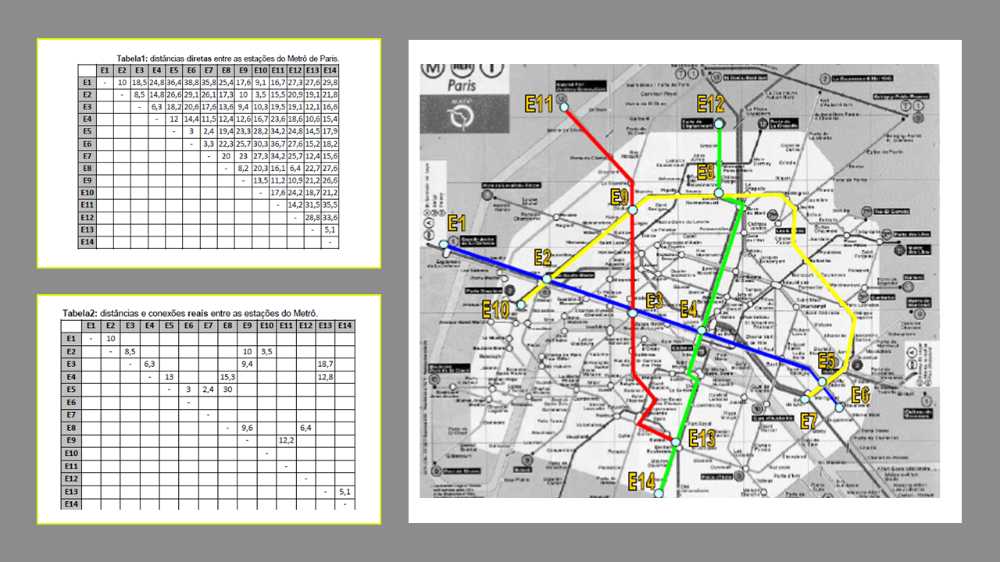

# ACA_CIn_20211
Adaptive and Cognitive Agents course (CIn/UFPE) problems.

## Problem 01 - Best path between stations: Paris Underground:
Find the shortest route between two different stations with A* algorithm .

